# Proyectos CSharp
Calculadora graficadora GUI, Simulador Cola Banco, Hasing y Tablas Hash y otros ejercicios POO hechos en C#
Parcial 1 & 2 para el curso de Programacion 3 - Ing. Sistemas USPG

## Formulário Principal
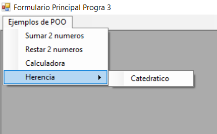
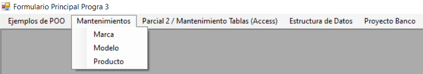
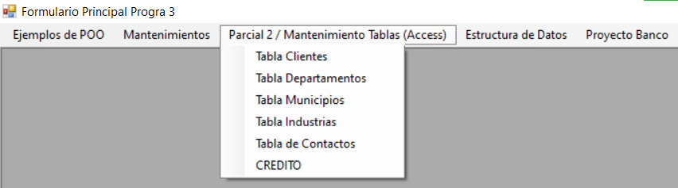
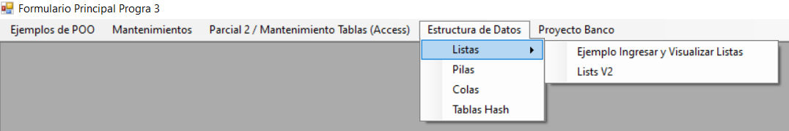

## Ejemplo Herencia
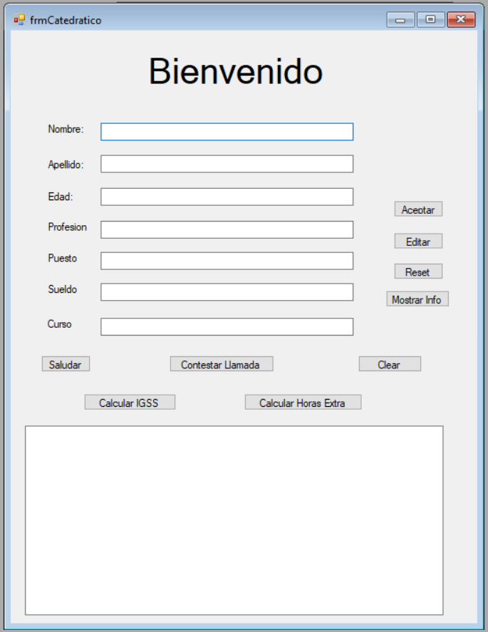

Ejemplos de herencia pedidos en clase, incluye la herencia de catedratico y etc.

## Restar & Sumar
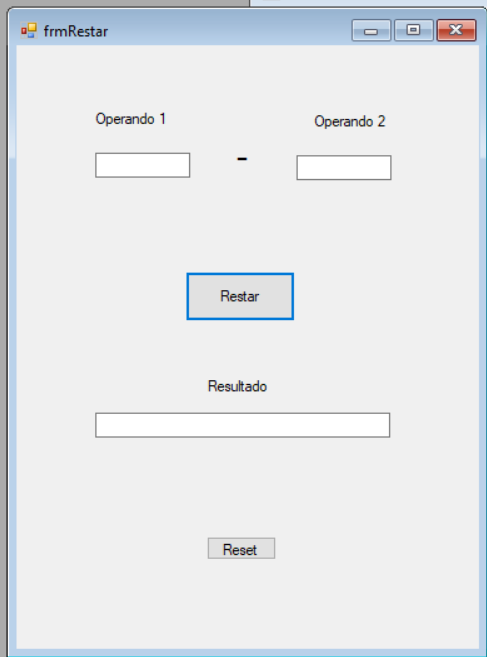
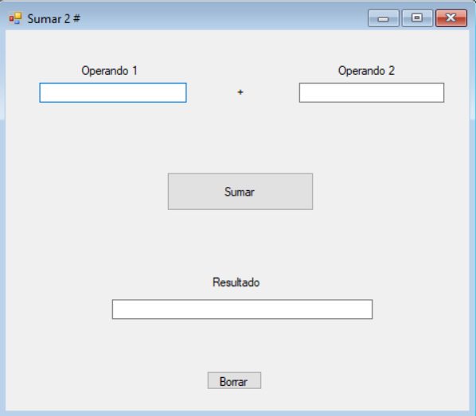

Elementos de la calculadora. 

# Calculadora
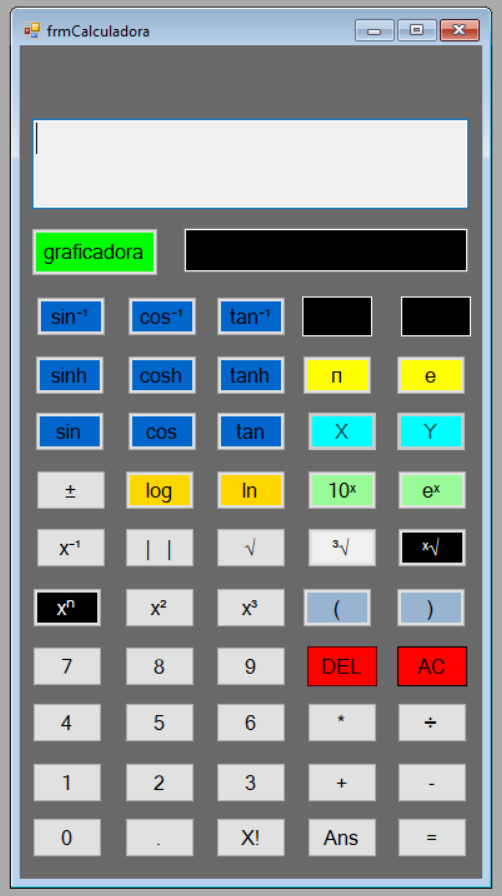
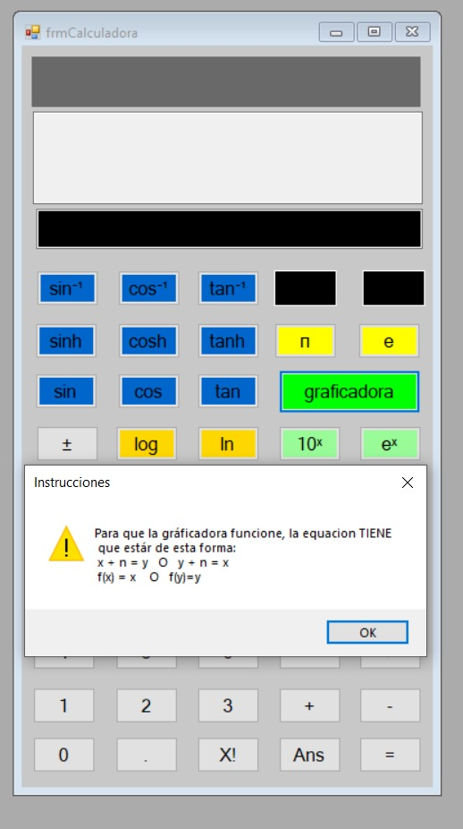
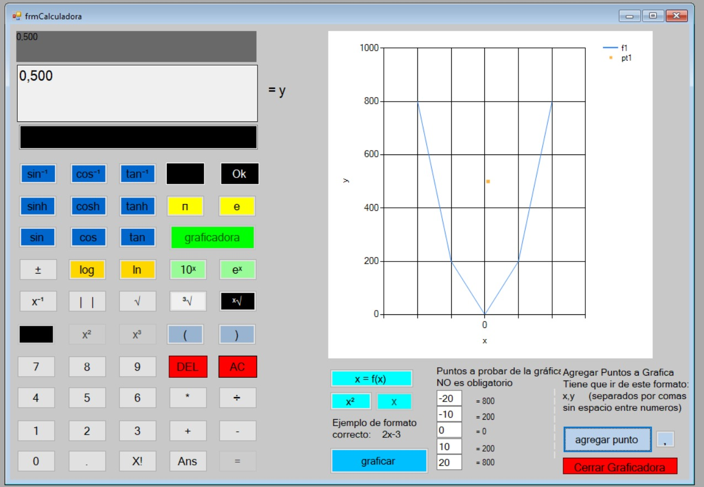
- Operaciones Básicas: Suma, Resta, Multiplicación y División ✅
- Operaciones Unarias: Potencia, Raíz, Logaritmos Naturales y de base 10, ✅
- Funciones Trigonométricas: Seno, Coseno, Tangente y las funciones inversas. ✅
- Teclas Especiales y constantes: Pi, e, factorial ✅
- Graficadora✅

# Simulador de Cola Banco
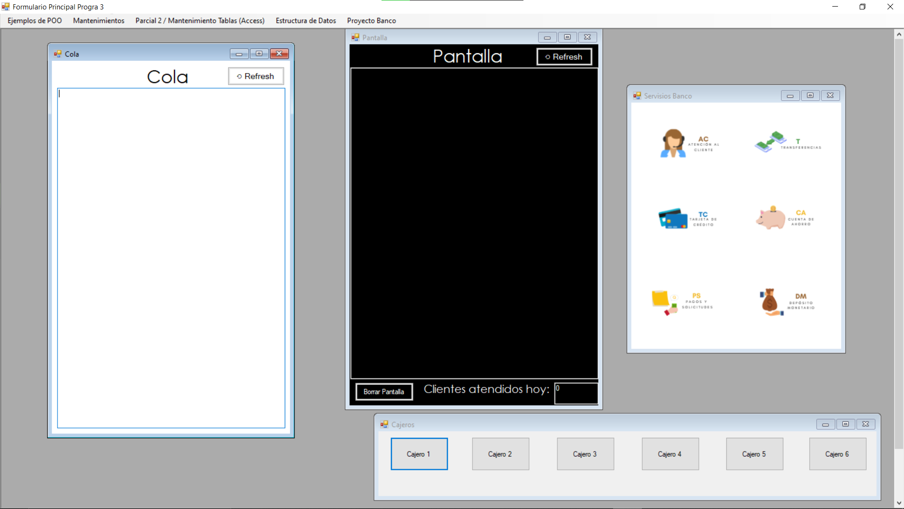
- Operaciones Básicas: Presenta la Vista de un Cliente, Administrador y Cajero en un Banco ✅
- Operaciones: Actualizacion en tiempo real de cola ✅
- GUI usando Queue y POO✅

# Tablas y Creditos
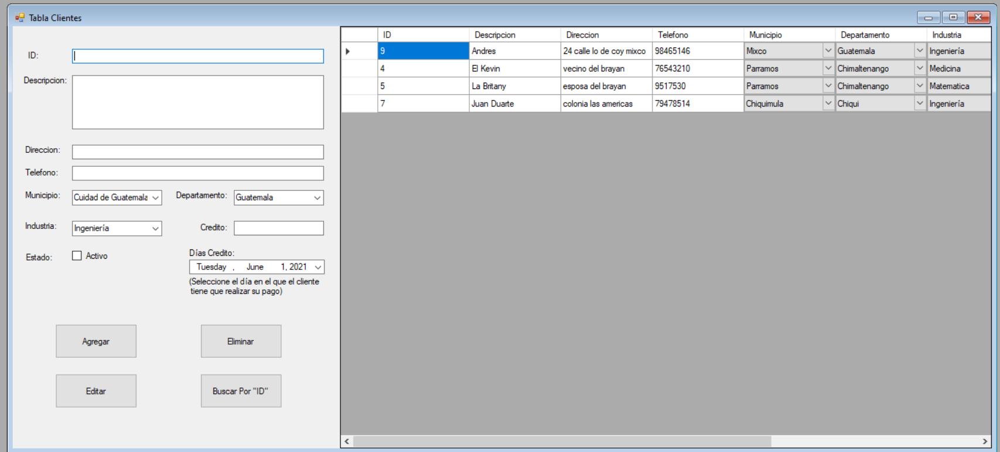
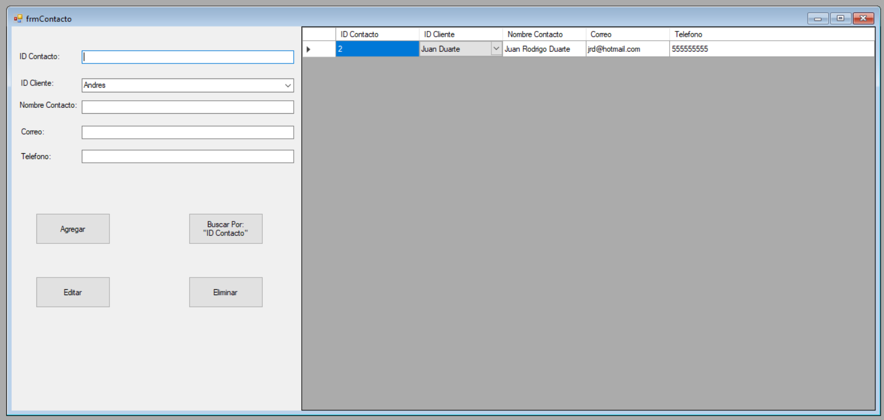
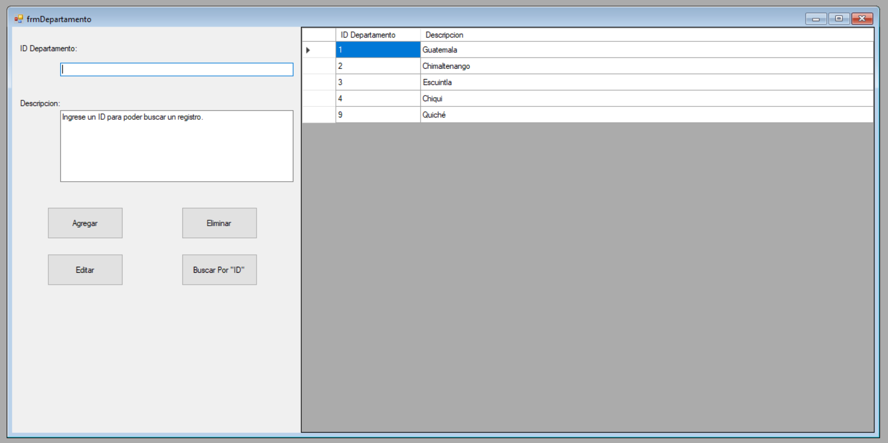
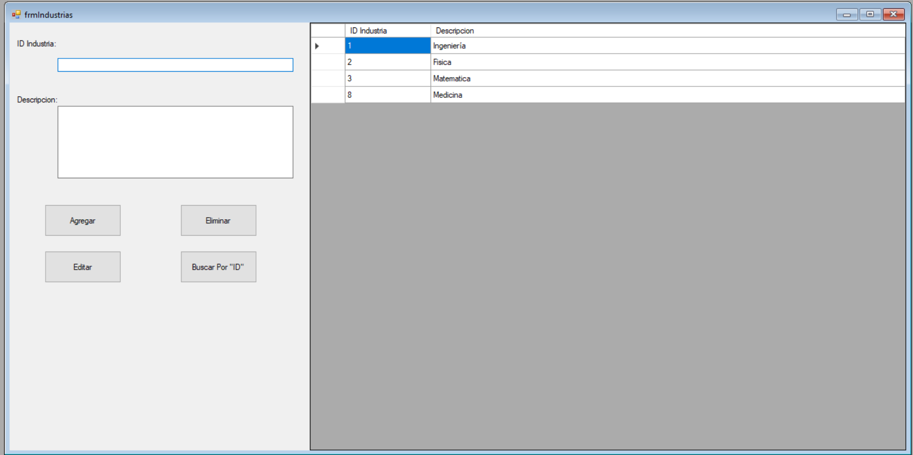
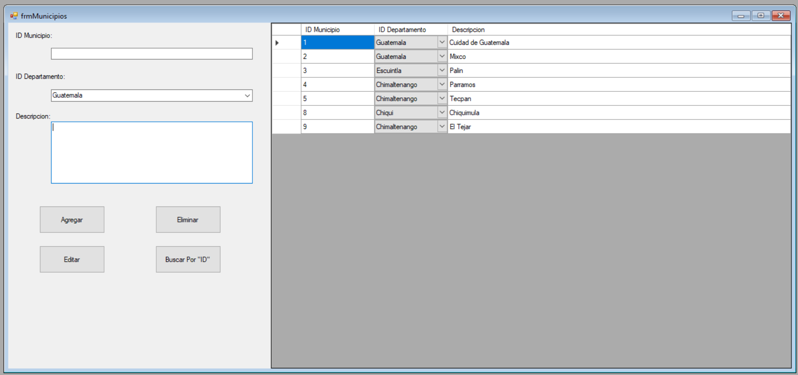

# Hash Tables

- Operaciones Básicas: Hash Method, Hash Table ✅
- Explicacion e implementacion de hasheo, hash tables, sondeo lineal, etc. ✅

## Colas
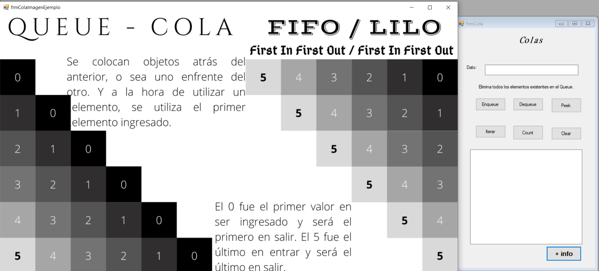
Representacion y explicacion del funcionamiento de las Colas.

## Stacks
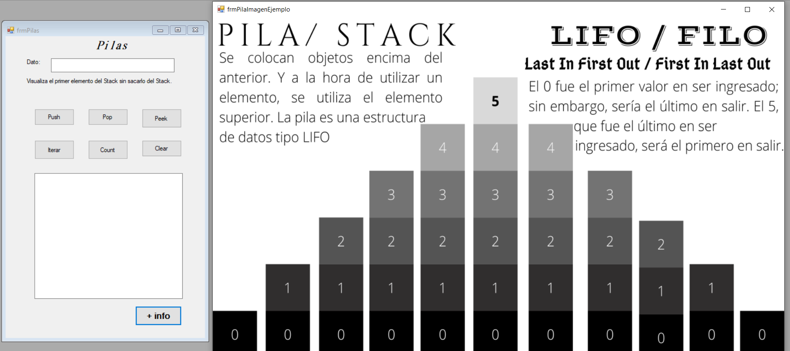
Representacion y explicacion del funcionamiento de las Pilas.

## Lists
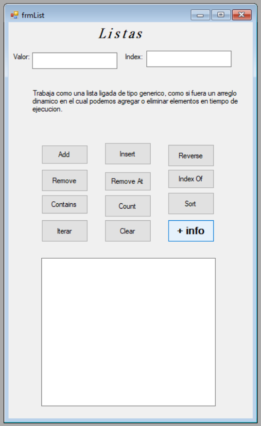

Representacion y explicacion del funcionamiento de las Listas.

## Fibonacci & Factorial
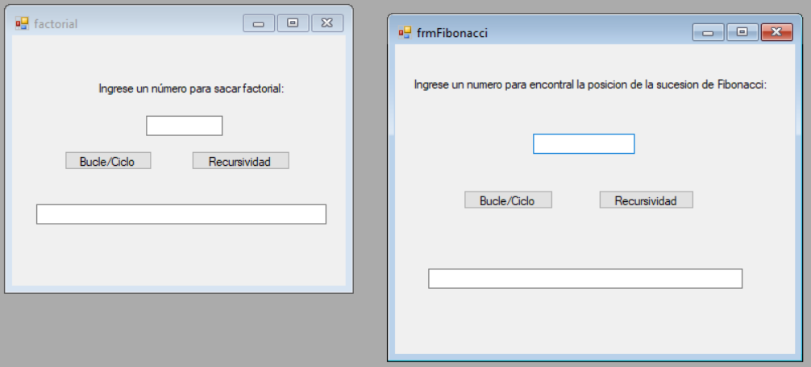
Codigo sencillo para uso de calcular fibonacci y factorial

## Mantenimientos de Tablas Access
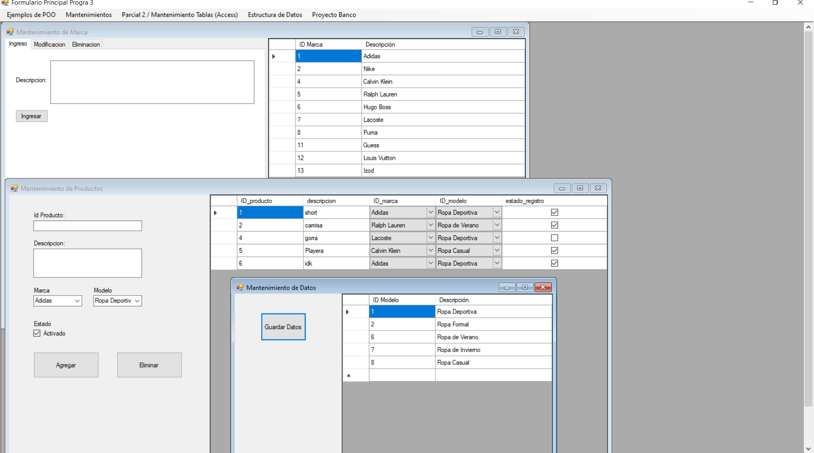
Mantenimientos de distintas tablas de access con distinta dificultad de mantenimiento.

### Clases incluidas en el proyecto
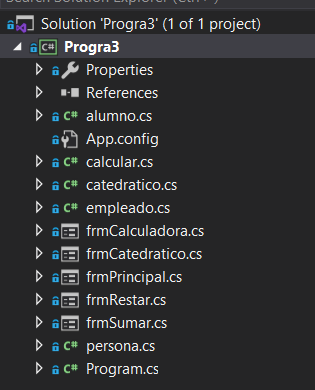
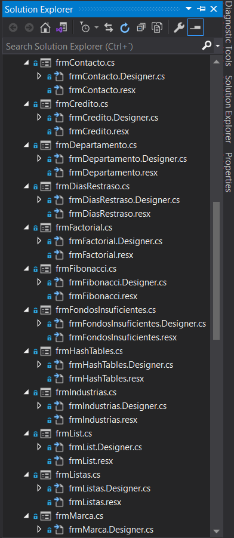
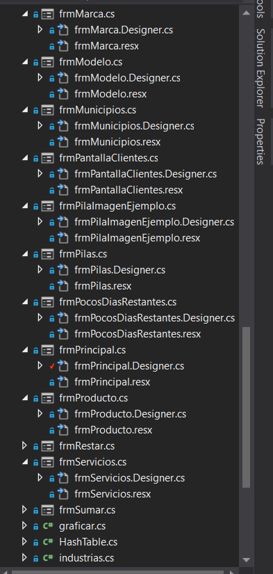
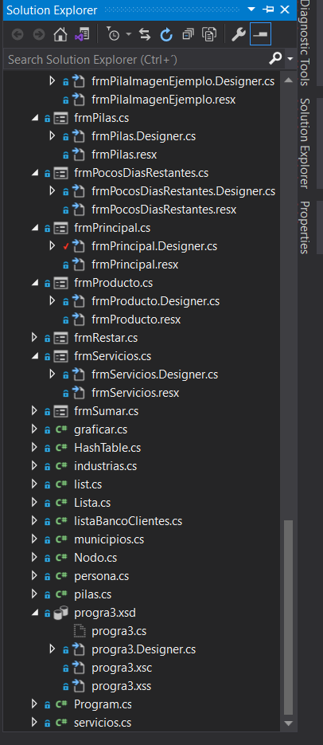

Gracias por su atencion. :)
